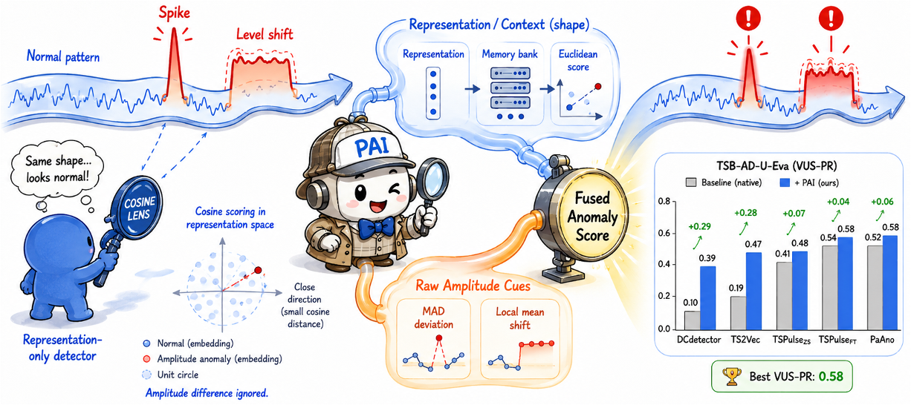

---

<h1 align="center">PAI: Preserving Amplitude Information in Representation-Based Time-Series Anomaly Detection</h1>

<p align="center">
  <strong>Kang Zhang<sup>1,2</sup>, Wei Jian Lau<sup>1</sup>, Shoushou Ren<sup>1</sup>, LIN Dong<sup>1</sup>, Joon Son Chung<sup>2</sup>, Chuanhao Sun<sup>1</sup></strong><br />
  <sup>1</sup> HUAWEI<br />
  <sup>2</sup> School of Electrical Engineering, KAIST
</p>

---




## 📈 Abstract

Representation-based time-series anomaly detection algorithms significantly outperform alternative methods on diverse anomaly detection tasks. However, we find that they suffer from a major limitation: **their learned embeddings are often amplitude-agnostic**. Losing amplitude information can degrade performance on amplitude-related anomalies, and this failure is prevalent across existing representation-based methods. To address this issue, we propose a new anomaly scoring scheme named PAI. PAI consists of two complementary modules: a diagnostic module and a final score augmentation function. The diagnostic module compares cosine and Euclidean scoring on the same representation bank to test whether amplitude information is already captured in the learned representation. PAI then computes a pointwise median/MAD deviation score and a local mean-shift score, which are fused with the representation score to produce the final anomaly score. On TSB-AD-U-Eva and TAB UV, PAI improves all four evaluated representation-based methods on every reported metric, with average VUS-PR gains from +0.048 to +0.293. Among all evaluated combinations, PaAno + PAI yields the best VUS-PR at 0.584. Further evaluation with bootstrap confidence intervals, anomaly-type breakdowns, and a TS2Vec input-normalization ablation supports the proposed scheme. These results suggest that explicitly retaining amplitude information is important for representation-based time-series anomaly detection.

paper: https://arxiv.org/abs/2606.08935

## 🚀 Quick Start

1. Create the environment.

   ```bash
   conda env create -f env.yaml
   conda activate tsbad
   ```

2. Download the dataset from [TSB-AD](https://github.com/TheDatumOrg/TSB-AD).

   Put the TSB-AD files under the repository `data/` directory:

   ```text
   data/
   ├── TSB-AD-U/
   │   └── TSB-AD-U/
   │       └── *.csv
   └── TSB-AD/
       └── Datasets/
           └── File_List/
               └── TSB-AD-U-Eva.csv
   ```

   No path configuration is needed with this layout.

3. Optionally validate the raw TSB-AD-U Eva files.

   ```bash
   ./reproduce.sh validate_data
   ```

4. Generate model prediction anomaly scores.

   To run every model and write the anomaly-score files needed for metric calculation, run:

   ```bash
   ./reproduce.sh generate_anomaly_scores
   ```

   This is the longest step. Model prediction anomaly scores are written under `outputs/score/` by default, and logs are written under `outputs/logs/`.

   For a one-file smoke test before the full run:

   ```bash
   source setup_env.sh
   python runners/run_ts2vec_eva.py \
     --score_dir outputs/score/TS2Vec \
     --log_path /tmp/paiad_ts2vec_smoke.log \
     --n_iters 1 --start 0 --end 1
   ```

   For full runs, shard the file list using `--start` and `--end`. The complete method map is documented in `runners/README.md`.

5. Calculate metrics to reproduce the tables.

   ```bash
   ./reproduce.sh main_table
   ./reproduce.sh ablation_table
   ```

   This writes:

   ```text
   outputs/aggregates/eva350/pool_means_main_table.csv
   outputs/FULL_COMPARISON_TABLE.md
   ```

   ```text
   outputs/aggregates/weight_ablation/sweep_eva350_all.csv
   outputs/WEIGHT_ABLATION_TABLE.md
   ```

   `reproduce.sh` already uses conservative threading defaults for stable metric calculation.

## 📊 Reproduce Tables

The reproduced main results are:

| Method | AUC-PR | VUS-PR |
|---|---:|---:|
| DCdetector original | 0.0585 | 0.0974 |
| DCdetector + PAI | 0.3751 | 0.3903 |
| TS2Vec original | 0.1885 | 0.1934 |
| TS2Vec + PAI | 0.4475 | 0.4727 |
| TSPulse_ZS original | 0.3241 | 0.4111 |
| TSPulse_ZS + PAI | 0.4311 | 0.4840 |
| PaAno original | 0.4591 | 0.5090 |
| PaAno + PAI | 0.5511 | 0.5842 |

## 🧾 Data Format

- The default file list is `data/TSB-AD/Datasets/File_List/TSB-AD-U-Eva.csv`.
- The default raw series directory is `data/TSB-AD-U/TSB-AD-U/`.
- Each series is read as `data/TSB-AD-U/TSB-AD-U/<file_name>.csv`.
- The final column must be named `Label`.
- Model prediction anomaly scores are stored as `.npy` or `.npz` files under `outputs/score/` by default.
- Aggregators accept either full-series or test-only score arrays and align labels automatically.

## 🙏 Acknowledgements

This release builds on public implementations and benchmark tooling from the following projects:

* [TSB-AD](https://github.com/TheDatumOrg/TSB-AD)
* [TS2Vec](https://github.com/zhihanyue/ts2vec)
* [DCdetector](https://github.com/DAMO-DI-ML/KDD2023-DCdetector)
* [TSPulse](https://github.com/ibm-granite/granite-tsfm)
* [PaAno](https://github.com/jinnnju/PaAno)

We thank the authors and maintainers of these projects for making their code and evaluation resources available to the community.
